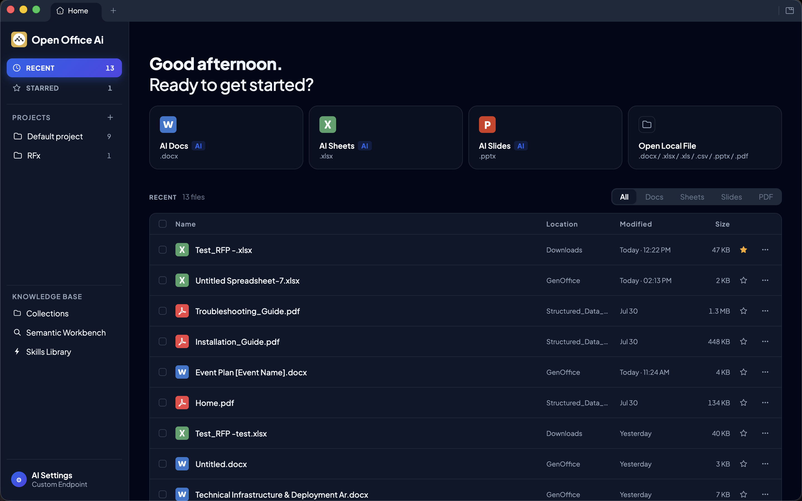
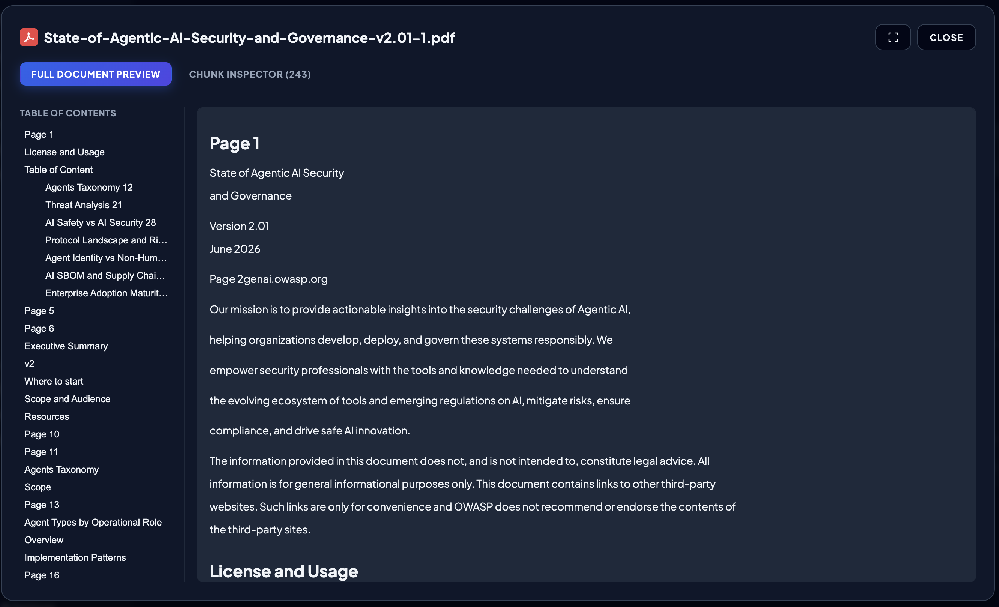
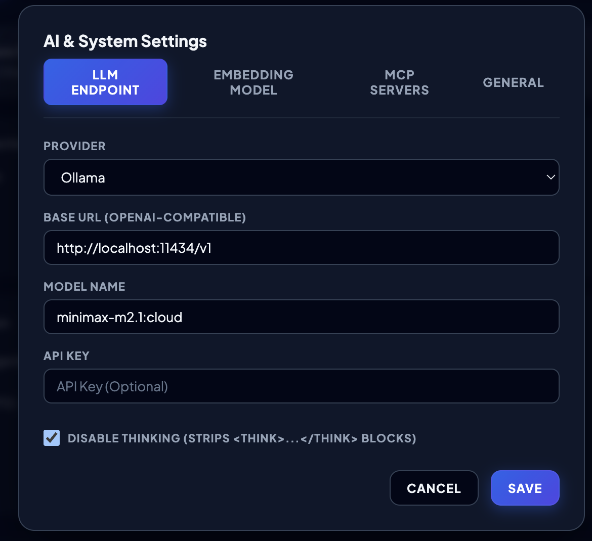
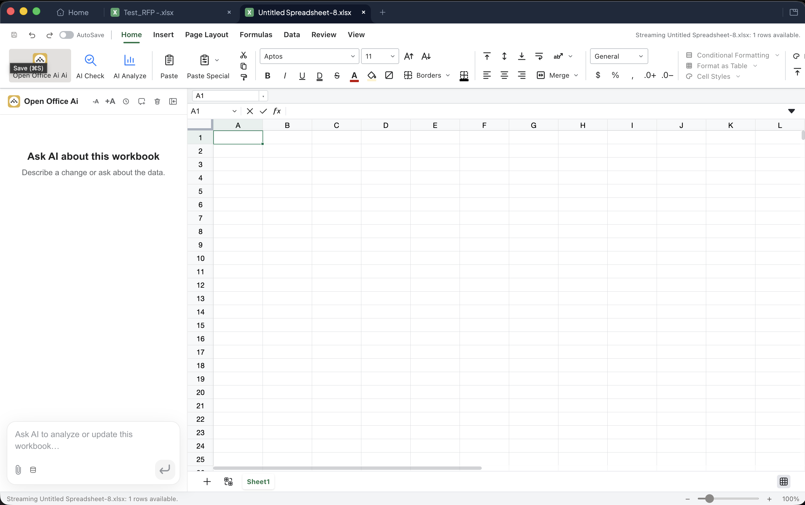

# Open Office Ai

An advanced, AI-native office suite for macOS and Windows featuring a word processor, spreadsheet, presentations, and PDF viewer. 

Open Office Ai is an independent fork of **GenOffice** under the Apache License 2.0. It builds on GenOffice's substantial foundation including its byte-preserving OOXML engines, rendering fidelity, and document editors—and introduces a comprehensive set of powerful new features, custom configurations, and a refined look and feel.

---


## Downloads

* 🪟 **Windows (x64):** [Download Installer](https://github.com/mbenetti/Open-Office-Ai/releases/download/v0.1.1/Open.Office.Ai.Setup.0.1.1.exe)
* 🐧 **Linux (AppImage):** [Download AppImage](https://github.com/mbenetti/Open-Office-Ai/releases/download/v0.1.1/Open.Office.Ai-0.1.1-arm64.AppImage)
* 🐧 **Linux (Debian/Ubuntu):** [Download DEB](https://github.com/mbenetti/Open-Office-Ai/releases/download/v0.1.1/Open.Office.Ai-0.1.1-arm64.deb)
* 🍏 ~~**macOS**~~ \* — not distributed as a prebuilt binary due to Apple's app signing & notarization requirements (a signed, notarized build requires a paid Apple Developer account).

### Building for your own use (macOS)

If you clone this repository and want to build the app for **personal use**, you can build an unsigned (ad-hoc signed) macOS app locally:

```bash
# Prerequisites: Node.js >= 20, Rust toolchain (cargo)
npm install

# Build all editor modules + the shell
npm run build:all

# Package the macOS DMG (unsigned / not notarized)
npm run dist:mac
```

The DMG will be written to `apps/shell/release/`. On first launch, macOS Gatekeeper will warn that the app is not notarized — open it with **right-click → Open**, or clear the quarantine flag:

```bash
xattr -d com.apple.quarantine "/Applications/Open Office Ai.app"
```

\* Only available for personal use on your own Mac; distributing a signed build requires an Apple Developer account.


## Key Features & Enhancements

### 1. LLM-Assisted Multi-Location Editing & Smart Attachments
* **Multi-Selection Context**: When selecting multiple cells in Sheets, multiple paragraphs in Word, or multiple elements in PowerPoint/PDF, the entire selection is packaged and sent to the LLM. This allows the AI to answer questions across multiple contexts simultaneously (e.g., answering a question in one cell based on the content of another).
* **Persistent Selection & Caret Highlighting**: Typing in the AI chatbox maintains a visible selection highlight (`.doc-selection-unfocused`) and cursor caret (`.doc-cursor-unfocused`) in the Word document. AI instructions ("rewrite this selection", "format this paragraph") execute against the exact active selection scope.
* **Attachment Table of Contents (TOC) Navigation**: Local attachment parsing extracts Level 1 (`#`) and Level 2 (`##`) headings with exact character offsets. The AI agent receives the document TOC directly in its per-turn prompt context and can jump directly to specific sections by heading title or offset.
* **Transparent Font & Formatting Inheritance**: Pasted external HTML and AI text insertions automatically strip foreign font-family, font-size, and line-height overrides, ensuring new text seamlessly adopts the document's and cursor's current font configuration. Context menus and ribbon controls support 1-click **Accept / Reject Change** for AI tracked revisions (`ins`/`del`).
* **Byte-Preserving Round Trip**: Manual and AI edits are applied as surgical patches. Only dirty paragraphs or cells are modified, keeping the rest of the original file byte-for-byte identical. Opening, editing, and saving never breaks original layouts, tracked changes, comments, styles, or equations.

### 2. Knowledge Base & Collection Management
* **Collection Workspace**: Create, rename, delete, and organize knowledge bases (collections) directly from the unified Upload Document tab.
* **SQLite & Permanent Disk Storage Architecture**:
  * **Inside SQLite (`knowledge-store.sqlite`)**: Manages collections, document metadata, Table of Contents (TOC) JSON structures, chunks, vector embeddings, and dual FTS5 virtual tables (`chunks_fts` and `documents_fts`).
  * **Outside SQLite (On Disk `md-documents/`)**: Full extracted document text is saved as permanent `.md` files (`doc-XXXXXXXX.md`).
  ```text
  Open Office Ai Knowledge Base Storage Layout
  ├── 📁 knowledge-store.sqlite (Inside SQLite Database)
  │   ├── 📊 collections (Folder/Collection metadata)
  │   ├── 📄 documents (Document metadata, TOC JSON, size, byte counts, md_path)
  │   ├── 🧩 chunks (Passage text, header paths, and vector embeddings)
  │   ├── 🔍 chunks_fts (FTS5 virtual table for chunk/passage keyword search)
  │   └── 📑 documents_fts (FTS5 external content virtual table for full-document BM25 ranking)
  │
  └── 📁 md-documents/ (Outside SQLite - On Disk)
      ├── 📝 doc-a1b2c3d4.md (Complete permanent Markdown file for document 1)
      ├── 📝 doc-e5f6g7h8.md (Complete permanent Markdown file for document 2)
      └── 📝 ...
  ```
* **Synchronized Deletion**: Deleting documents or collection folders automatically purges SQLite metadata, vector chunks, FTS indexes, and disk `.md` files.
* **KB Document TOC Navigation & Paging**: In addition to semantic RAG vector search, the AI chatbot can list collection documents (`list_knowledge_documents`) with TOCs and jump directly to specific sections by heading title or character range (`read_knowledge_document`) using concise IDs (`doc-XXXXXXXX`). In-memory text caching guarantees instant reading.
* **Navigation Tree & Preview**: Navigate your knowledge bases and documents using an intuitive left-panel tree structure with interactive TOC document previews.



### 3. Domain-Specific RAG & Hybrid Search
* **Dual SQLite FTS5 & Vector Hybrid Search**: Combines native SQLite FTS5 full-text keyword indexing (BM25 ranking) with local vector embeddings (cosine similarity), blended seamlessly using **Reciprocal Rank Fusion (RRF)**.
* **Dual FTS5 Indexing Architecture**:
  * **Passage-Level Index (`chunks_fts`)**: Evaluates BM25 keyword relevance bounded by ~2,000-character chunk boundaries.
  * **External Content Document Index (`documents_fts`)**: Uses SQLite FTS5 `content=''` external content virtual tables to calculate true full-document BM25 ranking without duplicating raw text inside SQLite (full text stays in permanent disk `.md` files).
* **Multi-Collection Selection (One or More KBs)**: Filter RAG queries by selecting one, multiple specific collections, or searching across all collections simultaneously. The chatbot UI allows users to toggle specific collections on demand, feeding only relevant, highly-targeted chunks to the LLM.
* **Semantic Workbench & Term Highlighting**: A dedicated testing tab ("Semantic workbench") featuring:
  * **Search Mode Selector**: Toggle between **Hybrid** (Vector + FTS via RRF), **Vector Only** (Cosine Similarity), and **FTS Only** (SQLite FTS5 BM25).
  * **Target Scope**: Filter between **Chunks / Passages** and **Documents** (aggregated).
  * **Term Highlighting**: Automatically highlights matching query keywords in yellow (`<mark>`) across header paths and retrieved text passages.

### 4. Reusable AI Skills (Slash Commands)
* **Skills Library**: Create, modify, and delete reusable AI skills in a dedicated tab.
* **Slash Autocomplete**: Recall skills on demand in the chatbot using the `/` command. Autocomplete lists available skills as you type (e.g., typing `/R` filters down to `/RFx_Analyzer`), preventing typing mistakes.

### 5. LLM, Search & Embedding Configuration
* **Custom Endpoints**: Configure custom OpenAI-compatible endpoints, local Ollama instances, and API keys for both LLM reasoning and embedding models.
* **Cascading Web Search**: Configurable search engine cascade: **Tavily API** (first, if key provided) → **Serper API** (Google Search) → **DuckDuckGo** (default fallback, no API keys required), managed via the dedicated Web Search settings tab.
* **Ollama & vLLM Integration**: First-class, dedicated providers for local Ollama and vLLM endpoints with dynamic placeholders, automatic default base URLs, and key-free execution support across all editors (Docs, Sheets, Slides, PDF).
* **Disable Thinking**: A robust, multi-level "Disable Thinking" option configurable directly from the LLM Endpoint settings panel. It sends the official `"think": false` parameter to Ollama, `"chat_template_kwargs"` / `"extra_body"` to vLLM, prepends special no-thinking tokens (such as `<no_thinking>`, `<not_think>`) to Qwen models, and uses a stateful stream filter to strip `<think>...</think>` blocks on the fly.
* **Privacy & Control**: Run fully local models or connect to your preferred cloud providers.



### 6. Refined Look and Feel
* **Open Office Ai Branding**: Complete custom branding, including the Open Office Ai logo and accent palettes.
* **Welcome Page Theme**: Toggle between Dark and Light modes for the welcome/home screen. Document editors maintain their clean, white document interfaces.
* **Collapsible Ribbon**: Double-click any ribbon tab to collapse or expand the toolbar, maximizing your vertical screen space.
* **Chat Font Zoom**: Increase or decrease the chat font size using `+A` and `-A` buttons in the header. The `-A` button is styled smaller than `+A` as an intuitive visual clue.
* **Dropdown Gating**: The previous-chats dropdown is anchored to the panel header and clamped to the panel width, ensuring it remains fully visible and never overflows the app window.
* **Unified RAG UI**: The PDF viewer's chatbox has been updated to use the modern database cylinder SVG icon and Segmented Control button group, aligning its look and feel perfectly with Docs and Sheets.



### 7. Fidelity & State Preservation
* **Zoom Preservation**: Captures and restores per-sheet zoom levels across save and auto-save reopens, preventing the view from resetting to 100% when the sidecar session reloads.
* **Font Inheritance**: AI-written cells automatically inherit the document's font (scanning the column above and row left, down to row 0 and column 0), respecting the document's manual formatting.
* **Parser Fidelity**: Fixed PDF parser line-break bugs to prevent empty lines from being inserted between sentences during chunking.

---

## Apps

| App | Product | What it is |
| --- | --- | --- |
| `apps/docs` | **Open Office Ai Docs** | `.docx` word processor. Byte-preserving paragraph patching, paginated layout metrics, tracked changes, comments, styles, equations, and ink. |
| `apps/sheets` | **Open Office Ai Sheets** | `.xlsx` spreadsheet. Built on [Univer](https://github.com/dream-num/univer) core (Apache-2.0) with custom extensions. Import/export runs through an in-house Rust sidecar (`calamine` + `IronCalc`), custom Konva charts, pivot tables, slicers, conditional formatting, and formula tracing. |
| `apps/slides` | **Open Office Ai Slides** | `.pptx` presentations. In-house parse/render/edit engine with masters, charts, cropping, ink, and HarfBuzz text metrics. |
| `apps/pdf` | **Open Office Ai PDF** | PDF viewer/editor on pdf.js + pdf-lib: annotations, forms, outlines, stamps, signatures, page operations, and print. |
| `apps/shell` | **Open Office Ai** | The suite shell: welcome home screen, tabbed hosting of the four editors, settings, and auto-update. |

---

## Engine Packages

All pure TypeScript, no Electron dependency, fully unit-tested:

* `packages/docx-engine` — docx parsing → block tree (with `docxIndex` anchors), OOXML fragment generation, byte-level paragraph patching.
* `packages/pptx-engine` / `packages/pptx-render` — pptx model and rendering.
* `packages/file-parse` — text extraction for AI attachments (office formats, PDF, markdown).
* `packages/agent-core` — the AI agent loop and skill composition shared by every app.
* `packages/ai-provider` — provider abstraction and streaming for the model backends.
* `packages/ai-search` — auth + web/image search tools.
* `packages/project-store` — recent-files store, chat-history database, and project-timeline aggregator.
* `packages/ui` — shared React UI kit (AI composer, typing indicators, icons, formatters).
* `packages/electron-utils` — shared main-process helpers, context menus, and external-link gating.

---

## Development & Building

### Prerequisites
* **Node.js**: `>= 20`
* **Rust Toolchain**: `cargo` on PATH (required for the Sheets xlsx sidecar)
* **MinGW-w64**: Required on macOS for cross-compiling the Windows sidecar (`brew install mingw-w64`)

### Commands
```bash
# Install dependencies
npm install

# Generate test .docx fixtures
npm run fixtures

# Run engine + app unit tests
npm test

# Run type checking across all workspaces
npm run typecheck

# Run all four editors + shell in development mode
npm run dev

# Package macOS DMG (unsigned/un-notarized by default)
npm run dist:mac

# Package Windows NSIS Installer (cross-compiled from macOS)
npm run dist:win
```

---

## Acknowledgments

Open Office Ai is an independent fork of GenOffice under the Apache License 2.0.

We are grateful to GenOffice contributors for opening the substantial foundation this fork builds on: the document, spreadsheet, presentation, and PDF applications; the OOXML engines; the rendering and round-trip fidelity work; and the original AI integration.

---

## License

Open Office Ai is licensed under the [Apache License 2.0](LICENSE). The GenOffice and Genspark names and logos are trademarks of Mainfunc, Inc. This fork uses its own custom branding and logos.
